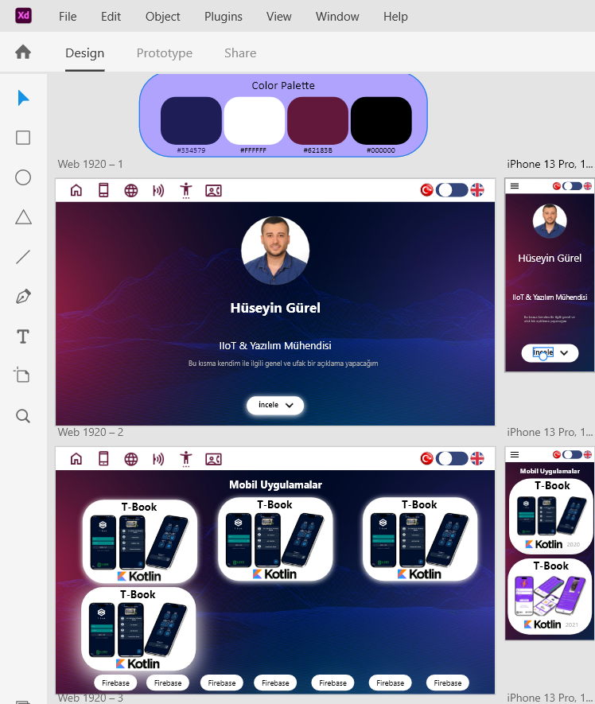

# Portfolio

Portfolio on 2025 by Hüseyin Gürel

## About Coding

- Web Page has only 1 scrollable sceen and it has 6 Sections (6 Container). Howewer, all navigation buttons scroll screen to sections
- Page has 2 modes for Responsive Designs like monitor or mobile. It works by screen pixel of width
- All assets, texts and models are in [constants/] folder
- Page has Turkish and English modes and Turkish texts are in [constants->text] folder. English mode works with Google Cloud Translation with Rest API
- Project has writen with MVVM Design Patterns by provider. Provider backend view models in [viewmodels/] folder.

The project was prepared by Hüseyin Gürel in March 2025

- [Linkedin Link](https://www.linkedin.com/posts/h%C3%BCseyin-g%C3%BCrel-183a4a85_merhaba-daha-%C3%B6nce-baz%C4%B1-detaylar%C4%B1n%C4%B1-payla%C5%9Ft%C4%B1%C4%9F%C4%B1m-ugcPost-7284225316636495872-M4EQ?utm_source=share&utm_medium=member_desktop&rcm=ACoAABIhUHMBJm62tKjKSEAX2-GQTGIEiC1oe1w)

